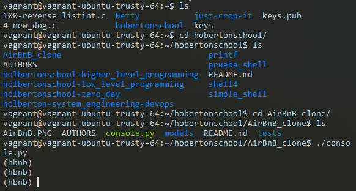
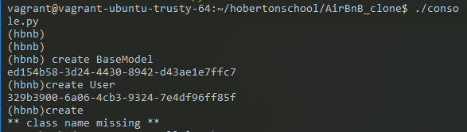
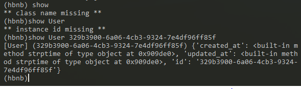
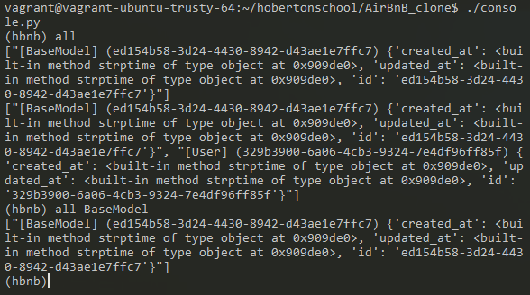

# AirBnB_clone 
### Welcome to the AirBnB clone project! (The Holberton B&B 
### First step: Write a command interpreter to manage your AirBnB objects.


This is the first step towards building your first full web application: the AirBnB clone. This first step is very important because you will use what you build during this project with all other following projects: HTML/CSS templating, database storage, API, front-end integration…

## What’s a command interpreter?

A command interprepart of a computer operating system that understands and executes commands that are entered interactively by a human being or from a program. In some operating systems, the command interpreter is called the shell.

This command interpreter could manage the objects of the all projects:

```
Create a new object (: a new User or a new Place)
Retrieve an object from a file, a database etc…
Do operations on objects (count, compute stats, etc…)
Update attributes of an object
Destroy an object
```

## Getting Started
In order to dowload the program and runs the command interpreter, it is necesary to copy the repository in your computer using the:
```
git clone <url>
```
To execute the program it is important to run the console file using the ./console.py, it is going to:
```
./console.py
```
That is all, let´s get into the command line interpreter!!

## FILES AND DIRECTORIES 

```
1. models directory contain all classes used for the entire project. A class, called “model” in a OOP project is the representation of an object/instance.
2. tests directory will contain all unit tests.
3. console.py file is the entry point of our command interpreter.
4. models/base_model.py file is the base class of all our models. It contains common elements:
   - attributes: id, created_at and updated_at
   - methods: save() and to_json()
5. models/engine directory will contain all storage classes (using the same prototype). For the moment you will have only one: file_storage.py.

```

## In order to understand & Running the program

### SYNOPSIS

The console is a command interprepart of a computer operating system that understands and executes commands that are entered interactively by a human being or from a program.

### DESCRIPTION

The first piece is to mante a powerful storage system. This storage engine will give us an abstraction between “My object” and “How they are stored and persisted”. This means: from your console code (the command interpreter itself) and from the front-end and RestAPI you will build later, you won’t have to pay attention (take care) of how your objects are stored.

This abstraction will also allow you to change the type of storage easily without updating all of your codebase.

The console will be a tool to validate this storage engine.

### CONSOLE

The console console.py contains the entry point od the command interpreter:

```
~/AirBnB$ ./console.py
(hbnb) help

Documented commands (type help <topic>):
========================================
EOF  help  quit

(hbnb)
(hbnb) help quit
Quit command to exit the program

(hbnb)
(hbnb)
(hbnb) quit 
:~/AirBnB$

```

### COMMANDS

1. create: Creates a new instance of BaseModel, saves it (to the JSON file) and prints the id.
```
Ex: $ create BaseModel
```

2. show: Prints the string representation of an instance based on the class name and id. 
```
Ex: $ show BaseModel 1234-1234-1234
```

3. destroy: Deletes an instance based on the class name and id (save the change into the JSON file)
``` 
Ex: $ destroy BaseModel 1234-1234-1234
```

4. all: Prints all string representation of all instances based or not on the class name
``` 
Ex: $ all BaseModel or $ all
```

5. update: Updates an instance based on the class name and id by adding or updating attribute (save thge into the JSON file).
```
Ex: $ update BaseMo-1234-1234 email "aibnb@holbertonschool.com"
```

#### EXAMPLES

##### cd command

How like looks the console:



Using the create command:



Using the show command:



Using the all command:



### GLOSARY & IMPORTANT DEFINITIONS

#### Storage 

Why separate “storage management” from “model”? It’s to make your models modular and independent. With this architecture, you can easily replace your storage system without re-coding everything everywhere.

You will always use class attributes for any oct. Why not instance attributes? For 3 reasons:

Provide easy class description: everybody will be able to see quickly what a model should contain (which attributes, etc…)
Provide default value of any attribute
In the future, provide the same model behavior for file storage or database storage

#### File storage == JSON serialization

For this first step, y write in a file all your objects/instances created/updated in your command interpreter and restore them when you start it. You can’t store and restore a Python instance of a class as “Bytes”, the only way is to convert it to a serializable data structure:

convert an instance to Python built in serializable data structure (list, dict, number and string) - for us it will be the method my_instance.to_json() to retrieve a dictionary
convert this data structure to a string (JSON format, but it can be YAML, XML, CSV…) - for us it will be a my_string = JSON.dumps(my_dict)
write this string to a file on disk
And the process of deserialization?

The same but in the other way:

read a string from a file on disk
convert this string to a data structure. This string is a JSON representation, so it’s easy to convert - for us it will be a my_dict = JSON.loads(my_string)
convert this data structure to instance - for us it will be a my_instance = MyObject(my_dict)

#### *args, **kwargs

*args and **kwargs are mostly used in function definitions. *args and **kwargs allow you to pass a variable number of arguments to a function. What does variable mean here is that you do not know before hand that how many arguments can be passed to your function by the user so in this case you use these two keywords. *args is used to send a non-keyworded variable length argument list to the function. 

#### datetime

datetime is a Python module to manipulate date, time etc…

In this example, you create an instance of datetime with the current date and time


## Authors
* **Mariana Plazas** - [marianaplazas]
(https://github.com/marianaplazas)
* **Maria Alejandra Coy** - [macoyulloa]
(https://github.com/macoyulloa)
Please read [AUTHORS]
(https://github.com/marianaplazas/AirBnB_clone/tree/staging) or details on our code of conduct, and the process for submitting pull requests 
